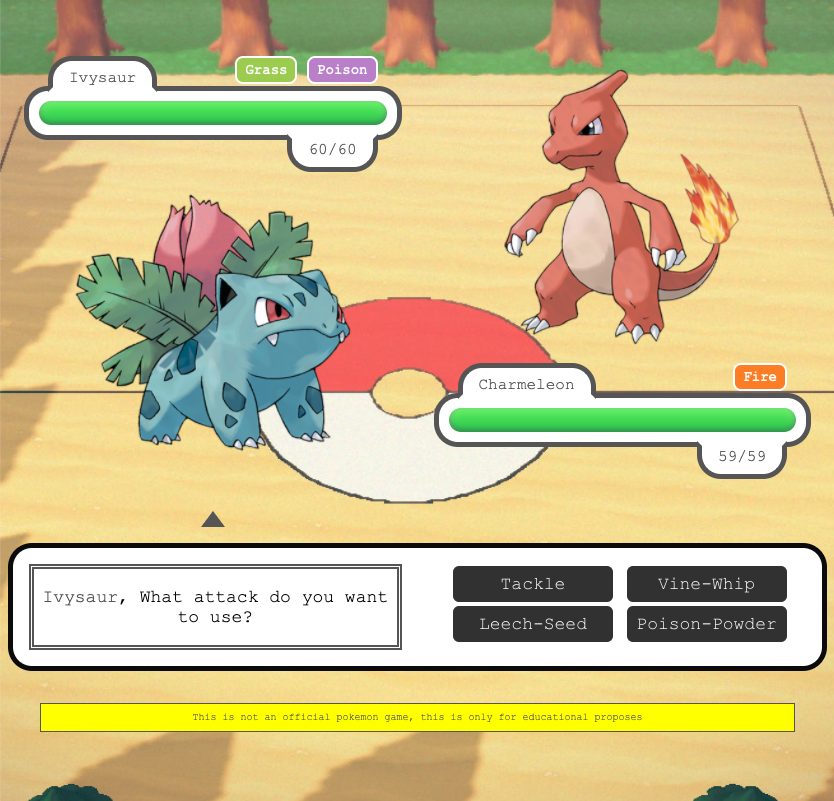

# Monster Battle

This is an exercise to learn Javascript on the Web using [PokeAPI](https://pokeapi.co/)

## Branches

### main (vanilla)

The game is finished in Vanilla JavaScript

### develop

Base branch to start from scracth

### jquery

Tranlasiting from Vanilla Javascript to jQuery with some animation

### webpack

Setup the project to use Webpack based on jQuery branch, Babel and other modern tools to work and build

Install dependencies

`npm install`

Development

`npm run dev`

Build project

`npm run build`

## Disclaimer

This is not a Pokemon official game, this exercise is only for learning purposes.
